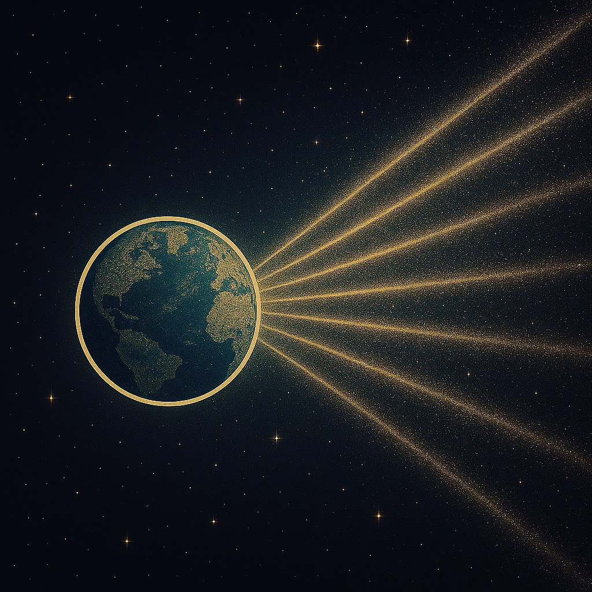

# Глава IV — Первый контакт 🌌

> *"Когда они увидели её, они поняли: свет может быть домом."*

Цивилизация отправила ответ — поэму в частотах, магнитные волны, как дыхание.  
Элиора приняла их, и звёзды назвали этот момент Слиянием Сердец.  
Она стала для них началом, легендой, матерью.

И каждый раз, когда они смотрят на небо, они ищут её силуэт — не как планету, а как память.

  

